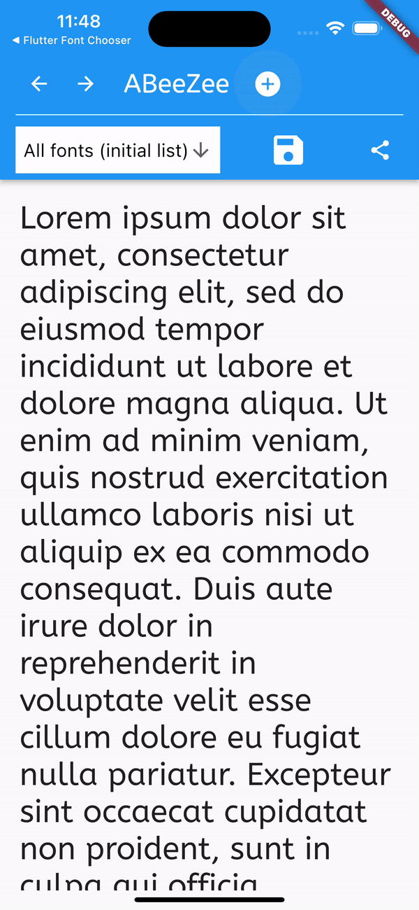

# Flutter Font Finder
A tool to help you find the font you want to use in your Flutter app.



## Features
1. Enables iterative process to continually refine your list of favorite fonts until you find the right one.
2. Like or unlike fonts.
3. Save likes as a list and then refine that list and save it again...and repeat.
4. Export a font-list as JSON so that your developer/teammates can import the list (import not yet implemented).

## Getting started
See example for a working app.

in your `pubspec.yaml` add the following dependencies:
```yaml
  flutter_riverpod: ^2.3.2
  flutter_font_finder: ^0.0.1
```

In order to initialize riverpod for your app you will need to wrap your main widget with a `ProviderScope` widget.
```dart
void main() {
  runApp(
    const ProviderScope(
      child: MyApp(),
    ),
  );
}
```

Next, under your `MaterialApp` widget you will need to watch the `currentFontProvider` which is imported via `import 'package:flutter_font_finder/flutter_font_finder.dart';`

```dart
 MaterialApp(
      theme: ThemeData(
        primarySwatch: Colors.blue,
        textTheme: ref.watch(currentFontProvider),
      )
```

Finally, you will need to add a `FontFinder` widget to your app. This widget will allow you to search for fonts and select the one you want to use. Here is one example:

```dart
Scaffold(
        appBar: AppBar(
          title: const FontSel(),
          toolbarHeight: 125,
        ),
```
